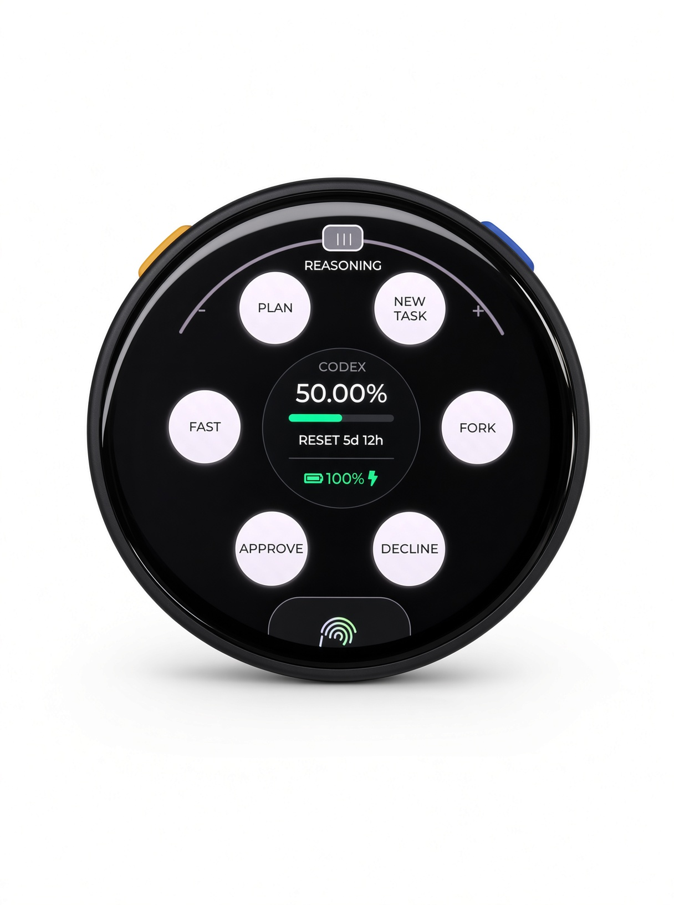
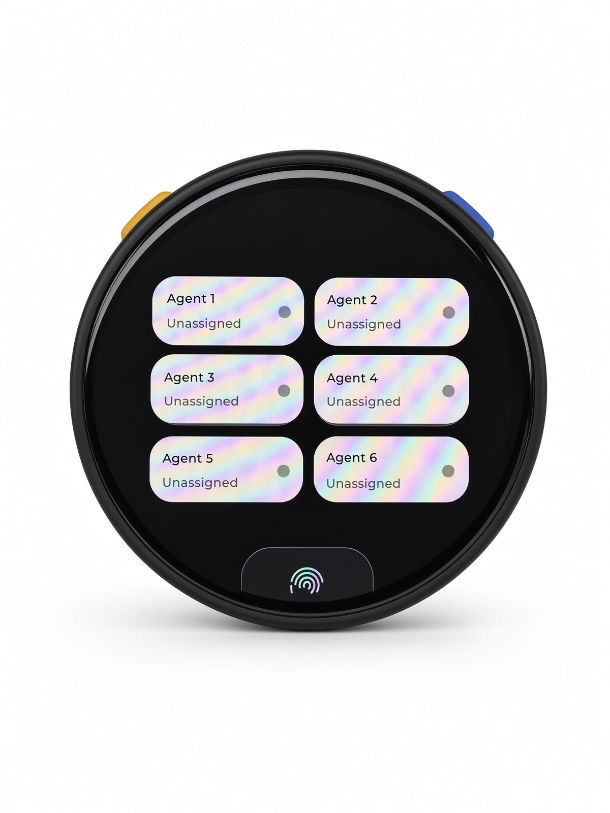

# Stopwatch Micro

**English** | [简体中文](README.zh-CN.md)

[](https://github.com/Dissipative-ATLAS/Stopwatch-Micro/actions/workflows/firmware-build.yml)
[](https://github.com/Dissipative-ATLAS/Stopwatch-Micro/actions/workflows/clang-format-check.yml)

Stopwatch Micro is dedicated firmware that turns the M5Stack StopWatch into an unofficial
Codex Micro-compatible controller. It boots directly into a two-page LVGL interface and keeps
Bluetooth Low Energy active as a system service; the original Mooncake launcher and demo apps are
not included.

> This project implements an unofficial compatibility layer for a protocol that is not a stable
> public API. A future ChatGPT update may require corresponding firmware changes.

## Product renders

<table>
  <tr>
    <td width="50%"></td>
    <td width="50%"></td>
  </tr>
  <tr>
    <td align="center">Command interface</td>
    <td align="center">Agent interface</td>
  </tr>
</table>

_Product concept renders supplied by the project owner._

## References and project status

Stopwatch Micro was built with reference to the following sources:

- [Official Codex Micro documentation](https://learn.chatgpt.com/docs/features/codex-micro) is the
  authoritative reference for pairing, controls, ChatGPT Desktop behavior, and the intended user
  experience.
- [`xuruiray/Stopwatch-Micro`](https://github.com/xuruiray/Stopwatch-Micro) provided the original
  public project foundation, repository structure, board-support integration, and early build/UI
  work. This independently maintained repository retains that contribution and upstream history.
- [`imliubo/codex-micro-4-core2`](https://github.com/imliubo/codex-micro-4-core2) is an unofficial,
  reverse-engineered compatibility implementation used as the engineering reference for the BLE
  HID identity, Codex Micro control IDs, and vendor JSON-RPC transport. The reviewed upstream
  revision is [`2ee23a4`](https://github.com/imliubo/codex-micro-4-core2/commit/2ee23a4ab696f94bb78d250f28cc4a9b879ba079).

This repository is an independent community project. It is not affiliated with, endorsed by, or
supported by OpenAI, ChatGPT, Codex, Work Louder, or the `codex-micro-4-core2` maintainers. The
official documentation describes supported product behavior, but it does not make the underlying
vendor protocol a stable public API. See [`THIRD_PARTY_NOTICES.md`](THIRD_PARTY_NOTICES.md) for the
upstream copyright and MIT license notice.

## Interface and controls

The functional UI is locked behind the connection state. When no compatible host is connected,
the display shows the Pairing screen; a successful connection opens Command, and a disconnect
returns immediately to Pairing.

| Input | Host control | Behavior |
| --- | --- | --- |
| Command left-top | `v.oai.rad` Plan direction | Toggle Plan mode |
| Command left-middle | `ACT06` | Fast |
| Command left-bottom | `ACT07` | Approve |
| Command right-top | `ACT11` | New Task |
| Command right-middle | `ACT09` | Fork |
| Command right-bottom | `ACT08` | Decline |
| Yellow physical A | `ACT10` | Hold for host push-to-talk; release to stop |
| Blue physical B | `ACT12` | Send |
| Physical A + B | local UI | Toggle Command and Agent |
| Agent 1–6 | `AG00`–`AG05` | Select the corresponding agent/thread |
| Top reasoning arc | `ENC_CC`, `ENC`, `ENC_CW` | Decrease/increase reasoning effort; press/select; returns to center |
| Bottom touch sensor | local system | Hold for 3 seconds to erase BLE bonds and restart pairing |

### One-time Codex Micro setup

After the device is detected for the first time, open **Settings → Codex Micro** and make these
host-side assignments:

1. Set **Dial → Reasoning only** so the top arc changes reasoning effort rather than navigating the
   composer.
2. Turn on **Use separate microphone keys**.
3. Select the independent `ACT11` switch and assign **New Task**. With the combined microphone-key
   setting, Codex Desktop intentionally ignores standalone `ACT11` events.
4. Confirm **Analog Up → Toggle plan mode**. This is the documented default, and the Plan button
   emits that direction.

These are ChatGPT Desktop settings, not firmware settings, so they may need to be applied again
after resetting the Codex Micro layout.

After a bond reset, remove the old `Codex Micro` entry from Windows Bluetooth settings if Windows
still retains it, then pair again.

An existing Windows bond reconnects automatically after a normal reset or power cycle. The Pairing
screen may appear briefly while BLE reconnects, then it should settle on Command without flashing
back and forth or requiring another pairing.

`ACT10` starts push-to-talk with the computer's selected microphone. This build configures the
StopWatch audio path for speaker output only: it does not enable the I2S receive channel, sample the
built-in MEMS microphone, or transport PCM audio. The Mic screen animation is a PTT activity
indicator, not an audio level meter.

The AMOLED stays on at the configured brightness while the firmware is running. A small periodic
pixel shift remains enabled to reduce static-image wear. Always-on operation increases battery use
and AMOLED aging; the pixel shift reduces but cannot eliminate burn-in risk.

The center circular status dial shows canonical Codex quota remaining, its reset countdown, and a
level-aware StopWatch battery icon with percentage and a charging indicator.
Quota data comes from the official Codex App Server through the wireless Bluetooth HID bridge; it is
marked stale after two minutes and unavailable after ten minutes rather than displaying a fabricated
value. See [`docs/bridge.md`](docs/bridge.md) for setup and the required one-time Codex Micro mappings.

## Web review prototype

The reviewable HTML version of the interface lives in [`web/index.html`](web/index.html). It models
connection, page, touch, reasoning-arc, and physical-key interactions without requiring the device.
The live GitHub Pages build is available below:

<https://dissipative-atlas.github.io/Stopwatch-Micro/>

Command is the default preview. Use `?paired=0` to show Pairing and `?mic=1` to preview the Mic
state. The page mirrors the six layered command keys, reasoning arc, quota card, battery icon, and
always-on policy. The separate A, B, and A+B review controls mirror hold-to-talk, send, and page
switching.

Changes under `web/` deploy automatically from `main`; **Deploy web prototype** can also be run
manually from the Actions tab.

## Source layout

```text
main/
├── main.cpp                         # hardware services and system-app bootstrap
├── system_config.h                  # BLE product identity and firmware version
├── debug/                           # USB Serial/JTAG diagnostic CLI
├── apps/
│   ├── app_codex_micro/             # the only application and LVGL UI
│   └── common/                      # shared key/audio helpers
└── hal/
    ├── ble/                         # HID and JSON-RPC compatibility transport
    └── ...                          # StopWatch board support
web/index.html                       # browser review prototype
docs/                                # architecture and validation notes
```

`main/CMakeLists.txt` uses an explicit source list so removed demo applications and assets cannot be
linked into the firmware accidentally.

## Build and flash

The validated toolchain is ESP-IDF v5.5.4.

On Windows, use the checked-in PowerShell entry point. It validates the toolchain, discovers the
ESP32-S3 USB Serial/JTAG port, refuses to flash until a full backup exists, and provides a guarded
factory restore path. Set `IDF_PATH` to your ESP-IDF v5.5.4 checkout, or pass `-IdfPath` to commands
that use the toolchain:

```powershell
$env:IDF_PATH = 'C:\path\to\esp-idf-v5.5.4'
.\tools\stopwatch.ps1 doctor -Port COM5
.\tools\stopwatch.ps1 deps -DirectGit
.\tools\stopwatch.ps1 build -SkipDeps
.\tools\stopwatch.ps1 backup -Port COM5
.\tools\stopwatch.ps1 flash -Port COM5 -Erase
.\tools\stopwatch.ps1 bridge -Transport bluetooth
```

Keep `bridge` running for live quota/reset updates. Bluetooth mode shares the paired HID collection
with Codex Desktop and does not open COM5, so the USB cable can be disconnected. Use `bridge -Once`
for one snapshot; pass `-Transport usb -Port COM5` only when explicitly using the serial fallback.

To install the hidden, single-instance bridge as a current-user Windows logon task:

```powershell
.\tools\bridge_autostart.ps1 install
.\tools\bridge_autostart.ps1 status
```

Use `stop`, `start`, or `remove` with the same script to manage it.

The first backup is a complete 16 MiB image. Restore it only when intentionally returning to the
factory firmware:

```powershell
.\tools\stopwatch.ps1 restore -Port COM5 `
  -BackupPath .\.artifacts\backups\<timestamp>\stopwatch_factory_16MiB.bin `
  -ConfirmRestore
```

On Linux or macOS, the equivalent low-level sequence remains:

```bash
python3 fetch_repos.py
source "$HOME/esp/esp-idf/export.sh"
idf.py build
idf.py -p /dev/cu.usbmodem21301 flash monitor
```

`repos.json` pins every source dependency to a full immutable commit SHA. ESP-IDF managed
dependencies are locked separately in `dependencies.lock`.

Discover the connected serial device first when the example port is not present. Generated
dependencies, builds, backups, and release artifacts are ignored by Git.

## Release artifacts

Download the release checksum and self-contained flashing ZIP from
[GitHub Releases](https://github.com/Dissipative-ATLAS/Stopwatch-Micro/releases). The bundle contains the
individual images, merged image, flashing script and plan, tested Codex version, wireless bridge,
logon-task helper, setup guide, licenses, and SHA-256 checksums. To reproduce it locally, run
`.\tools\stopwatch.ps1 package` from a clean commit.

## Serial diagnostics

The firmware exposes a non-blocking, line-oriented debug CLI over the primary USB Serial/JTAG
port. Commands always start with `debug` (or `dbg`) and finish with a machine-readable result such
as `DBG RESULT command=selftest status=PASS passed=17 failed=0`.

```text
debug help
debug status
debug selftest
debug controls
debug protocol
debug ui cycle
debug transport
debug perf 3000
debug trace 30000
debug mic 2500
debug inputs 20000
debug tone 880 350
debug vibrate 500 80
debug backlight 80
```

Before Codex is paired, run the bring-up suite with `-AllowOffline`. Once the Codex RPC handshake is
working, omit that switch: strict mode requires every functional test to pass and permits only the
non-confirmed pairing-reset command to return `SKIP`.

```powershell
.\tools\stopwatch.ps1 verify -Port COM5 -AllowOffline
.\tools\stopwatch.ps1 verify -Port COM5
```

The portable Python form is:

```bash
source "$HOME/esp/esp-idf/export.sh"
python3 -u tools/serial_debug_test.py --port /dev/cu.usbmodem21301
```

Add `--interactive` to include audible, haptic, physical-key, touch, and visual confirmation. Opening
the ESP32-S3 USB Serial/JTAG port may reset the board; the runner waits for a fresh `DBG READY` and
`ping` handshake before testing. `debug pairing-reset CONFIRM` is deliberately excluded because it
erases BLE bonds and restarts the device.

`debug mic` verifies the privacy boundary (`local_capture=disabled`); it does not record audio.
`debug perf` generates a safe 50 Hz neutral-joystick load and reports BLE queue depth, HID latency,
LVGL handler time, and touch-sampling gaps. For a real interaction trace, operate the physical
controls while running `python3 -u tools/serial_debug_test.py --trace-seconds 30`.

## Validation

The project has separate source-level, browser, build, and on-device checks. See
[`docs/validation.md`](docs/validation.md) for the current checklist and the distinction between
automated verification and host/device behavior that must be observed manually.

## Contributors

- **Dissipative-ATLAS** — project owner and hardware integration.
- **OpenAI Codex** — AI engineering contributor for firmware, the Windows bridge, UI iteration,
  testing, and documentation.

The Codex credit records AI-assisted engineering work on this community project. It does not imply
OpenAI sponsorship, endorsement, or official support.

## Attribution and license

The project is distributed under the MIT License. The original board support is derived from the
M5Stack StopWatch user demo, and the compatibility transport is adapted from
[`imliubo/codex-micro-4-core2`](https://github.com/imliubo/codex-micro-4-core2). See
[`THIRD_PARTY_NOTICES.md`](THIRD_PARTY_NOTICES.md) for revision and license details.
